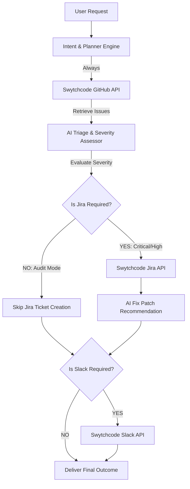

# 🚀 SwytchDev AI - Autonomous Software Engineer for Issue-to-Action Workflows

> **Buildathon Gurgaon Edition 2026 Submission**  
> **Track 1: AI Software Engineer**  
> *SwytchDev turns a developer's natural-language request into an agentic GitHub → Jira → Slack workflow, deciding which tools to use based on the issue context.*

---

## 🏆 Project Overview

**SwytchDev AI** reduces manual handoffs between issue investigation, task creation, and team notifications. It turns a multi-tool engineering workflow into a single natural-language interaction.

Rather than running a static, fixed sequence of API calls, **SwytchDev** acts as a dynamic reasoning agent that:
1. **Parses** user request intent (e.g. Full escalation vs Read-only audit vs Targeted Jira sync).
2. **Scans** open repository issues via **Swytchcode GitHub API**.
3. **Evaluates** issue severity & triage recommendations.
4. **Selects** downstream tools dynamically:
   - Invokes **Swytchcode Jira API** to create tickets *only* for high/critical severity items when requested.
   - Generates suggested AI code fix recommendations.
   - Dispatches team digests via **Swytchcode Slack API** when requested.
5. **Skips** unnecessary tool calls when read-only audits or partial workflows are specified.

---

## 🔌 Swytchcode APIs Integrated (3+ Mandatory APIs)

| Swytchcode API | Dynamic Tool Selection Trigger | Data Flow Integration |
| :--- | :--- | :--- |
| **Swytchcode GitHub API** | Invoked when repository or issue context is required. | Issues feed into AI Severity & Triage Evaluator. |
| **Swytchcode Jira API** | Executed dynamically when task tracking/escalation is requested. | Transforms GitHub issue details into structured Jira backlog tickets (`SWYTCH-402`). |
| **Swytchcode Slack API** | Executed dynamically when team alerts/broadcasts are requested. | Dispatches rich digests with Jira ticket references & AI patch suggestions. |

---

## 📊 Adaptive Agent Execution Architecture (DAG)



---

## 🧪 Verification & Judge Test Scenarios

SwytchDev includes 3 one-click test buttons to verify dynamic tool selection:

- **TEST 1 — Full Escalation Pipeline**: `"Find critical GitHub issues, create Jira tickets and notify Slack."`  
  *Executed*: GitHub ✓ • Jira ✓ • Slack ✓
- **TEST 2 — Read-Only Audit**: `"Find the critical issues in repository and summarize them."`  
  *Executed*: GitHub ✓ • Jira ✗ (Skipped) • Slack ✗ (Skipped)
- **TEST 3 — Targeted Sync**: `"Create a Jira ticket for GitHub issue #101."`  
  *Executed*: GitHub ✓ • Jira ✓ • Slack ✗ (Skipped)

---

## ⚙️ Quickstart & Local Setup

### 1. Prerequisites
- Node.js `v18+` or `v24+`
- npm `v9+`

### 2. Installation
```bash
git clone https://github.com/kumarakshu/SwytchDev-AI-Agent.git
cd SwytchDev-AI-Agent
npm install
```

### 3. Environment Variables (Optional)
Create `.env` file in project root:
```env
PORT=3001
SWYTCHCODE_API_KEY=your_swytchcode_api_key_here
```
*(If no API key is provided, SwytchDev automatically runs in high-fidelity Swytchcode API Sandbox mode).*

### 4. Run Dev Server
```bash
npm run dev
```
Open **`http://localhost:5173`** in your browser.

---

## 🎯 Hackathon Deliverables Checklist

- [x] **Working AI Agent** (Multi-step reasoning pipeline with dynamic tool selection)
- [x] **3 Swytchcode APIs Integrated** (GitHub, Jira, Slack)
- [x] **Public Code Repository**
- [x] **Architecture Diagram & Technical Specs**
- [x] **Interactive Real-Time Prompt Interface**
- [x] **Commudle Platform Submission Ready**

---

*Built with ❤️ at Thoughtworks Office, Gurgaon for Build with Swytchcode Buildathon.*
