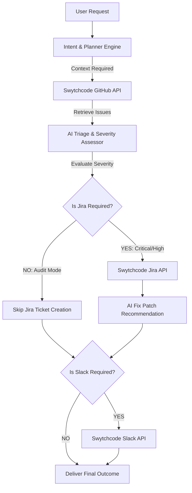
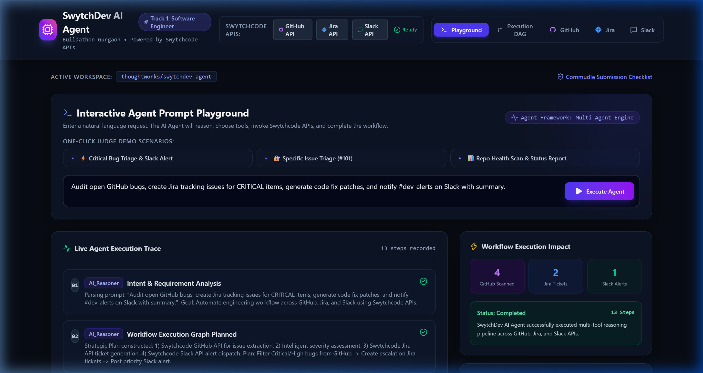
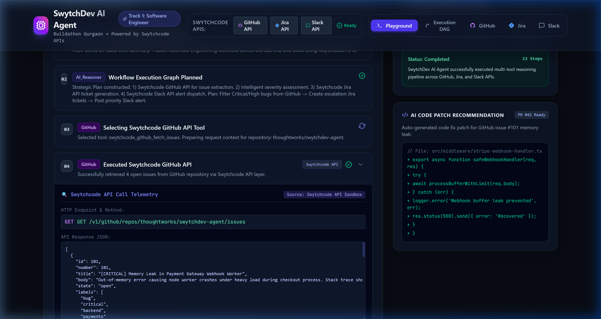
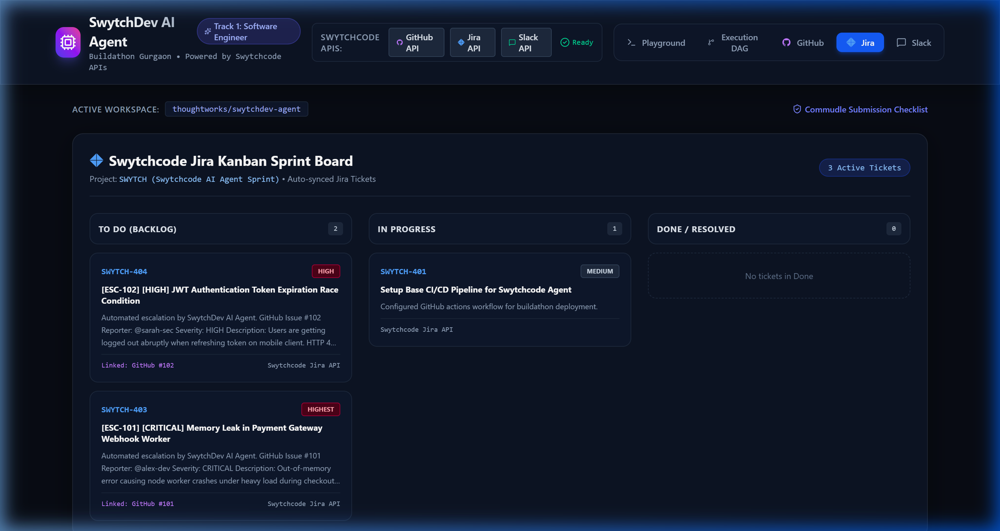
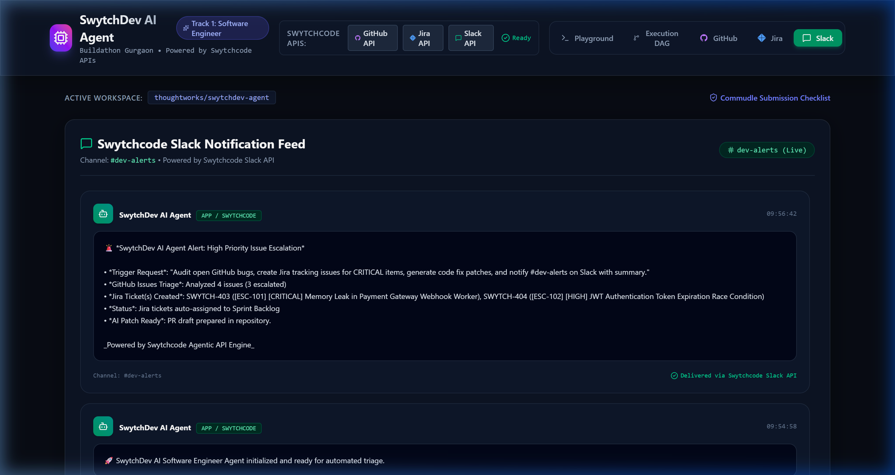

# 🚀 SwytchDev AI - Autonomous Software Engineer

> **Buildathon Gurgaon Edition 2026 Submission**  
> **Track 1: AI Software Engineer**  
> *SwytchDev turns developer natural-language requests into dynamic, context-aware engineering workflows by intelligently orchestrating Swytchcode APIs.*

---

## 🏆 Project Overview

**SwytchDev AI** automates manual engineering handoffs between repository issue investigation, task creation, code fix recommendations, and team communications.

Rather than executing a hardcoded sequence of API calls, **SwytchDev** acts as a dynamic reasoning agent that:
1. **Parses** user intent to analyze required action scopes (Full escalation vs Read-only audit vs Targeted task creation).
2. **Retrieves** issue data dynamically via **Swytchcode GitHub API**.
3. **Evaluates** root cause, stack traces, and issue severity.
4. **Executes Downstream Actions Dynamically**:
   - Invokes **Swytchcode Jira API** to create structured backlog tickets (`SWYTCH-402`) *only* for high/critical issues when task creation is requested.
   - Generates non-destructive **AI Code Patch Recommendations** for developer review.
   - Dispatches team digests via **Swytchcode Slack API** *only* when team broadcasting is requested.
5. **Skips Unnecessary API Calls** when specified by the user's intent.

---

## 🗺️ Agentic Decision Matrix

| User Request Scenario | Swytchcode GitHub API | Swytchcode Jira API | Swytchcode Slack API | AI Code Patch | Execution Outcome |
| :--- | :---: | :---: | :---: | :---: | :--- |
| **Audit & Summarize** (`"Summarize open issues"`) | ✅ Executed | ❌ **Skipped** | ❌ **Skipped** | ❌ **Skipped** | Read-Only Triage Summary |
| **Targeted Sync** (`"Create Jira ticket for issue #101"`) | ✅ Executed | ✅ Executed | ❌ **Skipped** | ❌ **Skipped** | Single Jira Task Created |
| **Full Escalation** (`"Triage critical bugs, create Jira tasks & notify Slack"`) | ✅ Executed | ✅ Executed | ✅ Executed | ✅ Executed | Full Workflow + Slack Broadcast |

---

## 🔌 Swytchcode APIs Integrated (3+ Mandatory APIs)

| Swytchcode API | Trigger Condition | Data Flow & Action | Live API Endpoint |
| :--- | :--- | :--- | :--- |
| **Swytchcode GitHub API** | Context required for repo issues. | Fetches open issues, bodies, stack traces, and labels. | `GET /v1/github/repos/:repo/issues` |
| **Swytchcode Jira API** | Escalation / task tracking requested. | Creates structured Jira backlog tickets with priority mapping. | `POST /v1/jira/issue` |
| **Swytchcode Slack API** | Team alert / digest requested. | Posts formatted rich alerts with Jira keys & AI patch suggestions to `#dev-alerts`. | `POST /v1/slack/chat.postMessage` |

---

## 📊 Adaptive Agent Execution Architecture (DAG)



---

## 🖼️ Visual Screenshots & Evidence

| Component | Visual Demonstration |
| :--- | :--- |
| **Agent Playground & Decision Log** |  |
| **Swytchcode API Telemetry & Payload Inspector** |  |
| **Jira Backlog Board Integration** |  |
| **Slack Broadcast Feed Integration** |  |

---

## 🧪 Verification & Judge Test Scenarios

SwytchDev includes preset test scenarios to prove dynamic decision making:

- **TEST 1 — Full Escalation Pipeline**: `"Find critical GitHub issues, create Jira tickets and notify Slack."`  
  *Executed*: GitHub ✓ • Jira ✓ • Slack ✓ • AI Patch ✓
- **TEST 2 — Read-Only Audit**: `"Find the critical issues in repository and summarize them."`  
  *Executed*: GitHub ✓ • Jira ✗ (Skipped) • Slack ✗ (Skipped)
- **TEST 3 — Targeted Sync**: `"Create a Jira ticket for GitHub issue #101."`  
  *Executed*: GitHub ✓ • Jira ✓ • Slack ✗ (Skipped)

---

## 🛡️ Security, Governance & Code Patch Safety

- **Human-in-the-Loop Patch Review**: SwytchDev generates **AI Code Patch Recommendations** for developer review rather than auto-merging pull requests into production repositories.
- **Authorization Token Masking**: All API authorization headers and secrets are automatically masked in the Telemetry Inspector (`Bearer ************`).
- **Zero Hardcoded Secrets**: Project relies on `.env` or automatic high-fidelity **Swytchcode API Sandbox** fallback mode.

---

## 🧪 Graceful Failure & Edge Case Handling

- **Non-existent Resource Requests**: When prompted with non-existent issue numbers, the agent gracefully returns a clean 404 notice without creating redundant Jira tickets or Slack spam.
- **Prompt Injection Defense**: User prompts and retrieved GitHub payloads are treated strictly as untrusted data inputs, preventing malicious instruction overrides.

---

## ⚙️ Quickstart & Local Setup

### 1. Prerequisites
- Node.js `v18+` or `v24+`
- npm `v9+`

### 2. Installation
```bash
git clone https://github.com/kumarakshu/SwytchDev-AI-Agent.git
cd SwytchDev-AI-Agent
npm install
```

### 3. Environment Variables (Optional)
Copy `.env.example` to `.env`:
```bash
cp .env.example .env
```
*(If no API key is provided, SwytchDev automatically runs in high-fidelity Swytchcode API Sandbox mode).*

### 4. Run Development Server
```bash
npm run dev
```
Open **`http://localhost:5173`** in your browser.

---

## 🎯 Hackathon Deliverables Checklist

- [x] **Working AI Agent** (Multi-step reasoning pipeline with dynamic tool selection)
- [x] **3 Swytchcode APIs Integrated** (GitHub, Jira, Slack)
- [x] **Public Code Repository**
- [x] **Architecture Diagram & Technical Specs**
- [x] **Interactive Real-Time Prompt Interface**
- [x] **Commudle Platform Submission Ready**

---

*Built with ❤️ at Thoughtworks Office, Gurgaon for Build with Swytchcode Buildathon.*
